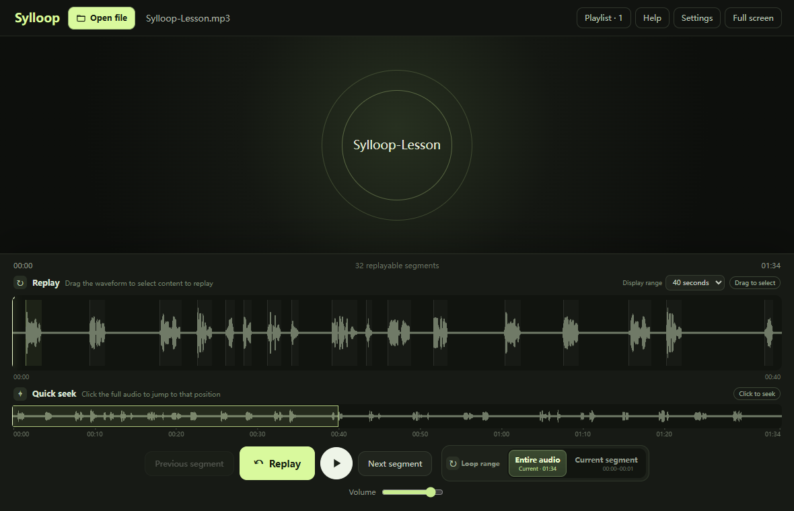
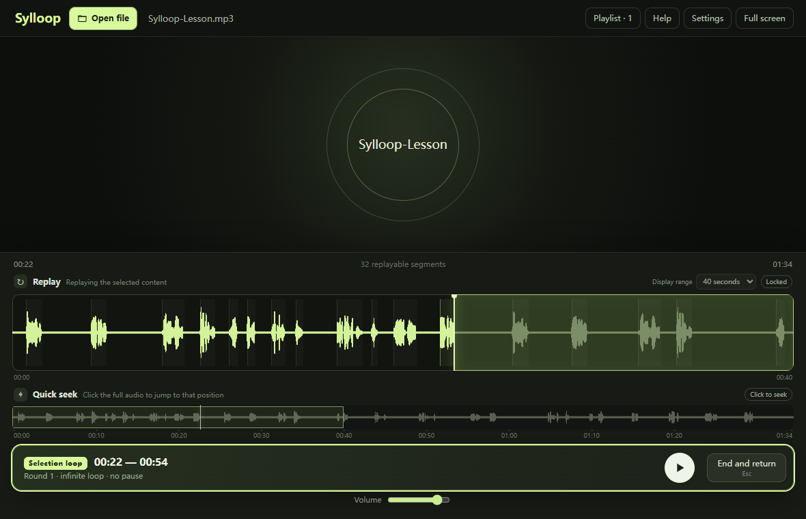
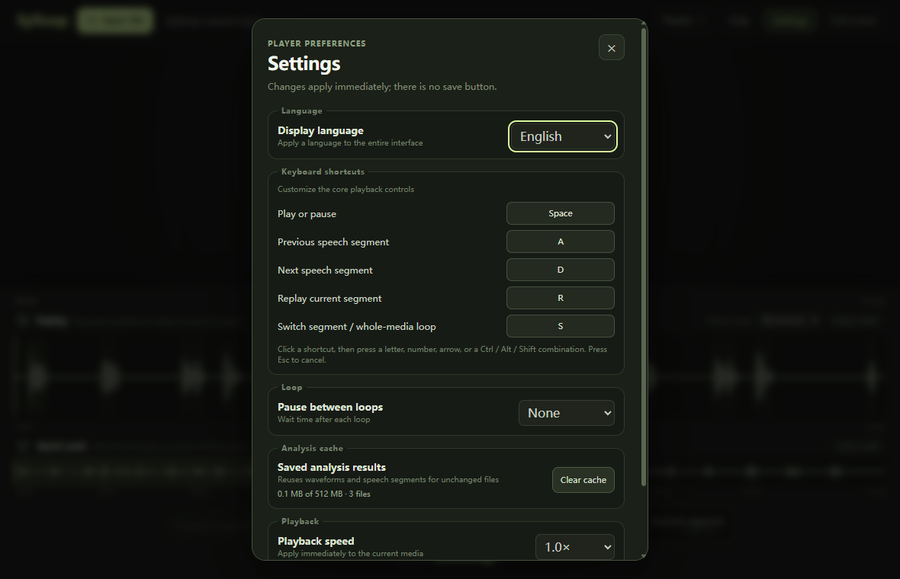

[简体中文](README.zh-CN.md)

# Sylloop

Sylloop is a Windows and macOS desktop media player built for language-learning workflows that depend on quick replay and precise repetition. It works with local audio and video, generates a waveform and pause-based segments with FFmpeg, and provides several ways to repeat a segment or an arbitrary selection.

## Screenshots



| Focused selection loop | Player settings |
| --- | --- |
|  |  |

## Highlights

- Open or drag in MP4, M4V, WebM, MP3, M4A, AAC, WAV, FLAC, and OGG files.
- Build a temporary playlist from supported files in the selected file's directory.
- Generate waveforms and pause-based segments with the bundled FFmpeg analyzer.
- Replay the current segment with preroll, move between segments, loop a segment or the full media, and create waveform A-B loops.
- Customize core playback shortcuts for play/pause, previous or next speech segment, replay, and loop-range switching.
- Adjust playback speed from 0.5x to 2.0x, volume, fullscreen mode, window opacity, always-on-top behavior, and the pause between loop iterations.
- Pin the player above a PDF from the top bar, or configure opacity and window behavior from Settings.
- Restore playback, window, language, and keyboard preferences to their defaults from Settings.
- Open another file from an explicit top-bar action, and use Help to report a problem, suggest an improvement, or visit the project page.
- Use the interface in English, Simplified Chinese, Traditional Chinese, or French.

Playlist discovery is intentionally non-recursive. Reaching the end of a media file stops playback instead of advancing automatically. Across launches, the application retains only volume, speed, loop-gap, window opacity, always-on-top, language, and keyboard-shortcut preferences.

## Requirements

### Running the application

- Windows 10 or Windows 11
- Microsoft Edge WebView2 Runtime, which is normally included with supported Windows versions
- macOS 11 or later on Apple Silicon or Intel

Official packages include a pinned LGPL FFmpeg executable. They are currently unsigned: Windows may display a SmartScreen warning, and macOS may initially block the app. On macOS, Control-click Sylloop in Finder and choose **Open** to confirm that you trust the downloaded app. Obtain packages from [GitHub Releases](https://github.com/soloradish/sylloop/releases), verify them with the published `SHA256SUMS.txt`, and use the [exact FFmpeg corresponding-source bundle](https://github.com/soloradish/ffmpeg-dist/releases/download/v8.1.2-r1/ffmpeg-8.1.2-r1-sources.tar.xz) when rebuilding the bundled analyzer.

### Developing the application

- Windows or macOS with the native build prerequisites required by Tauri 2
- Node.js 24.16.0, pinned in `.nvmrc` and `package.json`
- Rust 1.96.0 with `rustfmt` and `clippy`, pinned in `rust-toolchain.toml`
- PowerShell on Windows or a POSIX shell on macOS

## Project page and feedback

Visit the [Sylloop project page](https://lowid.me/en/sylloop/) for product and download information. Public problem reports and feature requests are handled through [GitHub Issues](https://github.com/soloradish/sylloop/issues/new/choose). A GitHub account is required; search existing issues first, include the application and operating system versions plus reproducible steps, and do not upload private media or sensitive information.

## Architecture

| Layer | Technology | Responsibility |
| --- | --- | --- |
| Desktop shell | Tauri 2 | Window lifecycle, dialogs, asset access, packaging, and IPC |
| User interface | React 19 + TypeScript | Player controls, waveform interaction, playlists, settings, and localization |
| Client state | Zustand | Playback state, analysis state, loop state, playlist state, and persisted preferences |
| Native backend | Rust | File validation, directory playlists, FFmpeg execution, cancellation, and the analysis cache |
| Analyzer | FFmpeg | Decode media to 16 kHz audio for waveform and pause-based segment detection |
| Tests | Vitest + WebdriverIO | Frontend behavior, Rust logic, Windows end-to-end coverage, and macOS package smoke tests |

### Media and analysis flow

1. The React application receives a selected or dropped media path and calls the `open_media_context` Tauri command.
2. Rust canonicalizes and validates the path, scans only its parent directory for supported media, and grants the asset protocol access to the resulting playlist.
3. The WebView plays the selected asset while `analyze_audio` runs FFmpeg in a background task.
4. Analysis progress is delivered through a Tauri channel. The final waveform and segments are accepted only if they still belong to the active request.
5. Successful analysis results are cached under the application data directory. The versioned cache is capped at 512 MiB and evicts older entries when necessary.

The native IPC surface is registered in `src-tauri/src/lib.rs` and currently contains:

- `open_media_context`
- `get_analysis_capability`
- `analyze_audio`
- `cancel_analysis`
- `get_analysis_cache_stats`
- `clear_analysis_cache`

Rust response types use camelCase serialization to match their TypeScript counterparts in `src/types.ts`.

## Project layout

| Path | Purpose |
| --- | --- |
| `src/App.tsx` | Main player orchestration, media lifecycle, keyboard behavior, loops, and IPC calls |
| `src/components/` | Waveform, settings, progress, icons, and error-boundary UI |
| `src/store.ts` | Zustand store and persisted preference validation |
| `src/i18n.tsx` | Locale detection, message catalogs, and localized formatting |
| `src/lib/` | Pure playlist and segment helpers |
| `src-tauri/src/lib.rs` | Tauri commands, FFmpeg analysis, caching, file access, and Rust tests |
| `src-tauri/capabilities/` | Tauri permissions for the production application |
| `scripts/` | FFmpeg preparation, E2E fixture generation, E2E builds, and installer smoke tests |
| `e2e/` | Native Windows WebdriverIO configuration, capabilities, fixtures, and specifications |
| `.github/workflows/` | Windows/macOS CI and tagged release workflows |

Unit tests are colocated with the frontend modules they cover. Rust unit tests live in `src-tauri/src/lib.rs`, and native application tests live under `e2e/specs/`.

## Getting started

Install the pinned dependencies and prepare the locked FFmpeg build:

```powershell
npm ci
npm run ffmpeg:prepare
```

The FFmpeg preparation script downloads the exact platform and architecture-specific `soloradish/ffmpeg-dist` artifact recorded in `scripts/ffmpeg-lock.json`, verifies its SHA-256 digest, build metadata, architecture, and `core` profile, and rejects GPL, nonfree, version3, or network-enabled builds.

Start the native Tauri development application:

```powershell
npm run tauri:dev
```

## Development modes

### Native Tauri development

Use `npm run tauri:dev` for real file dialogs, drag and drop, asset permissions, media playback, and FFmpeg analysis. This is the normal development mode for behavior that crosses the React/Rust boundary.

### Browser layout preview

For quick UI work, run:

```powershell
npm run dev
```

Then open `http://127.0.0.1:1420/?demo=1`. Add `&playing=1` to render the demo in its playing state. Demo mode provides deterministic media, waveform, segment, and playlist data, but it does not provide native file access or real FFmpeg analysis.

### Native Windows E2E

The E2E build enables the WebDriver plugins only through the Rust `e2e` feature. Production builds do not include the test interface.

```powershell
npm run build:e2e
npm run test:e2e:tauri
```

`build:e2e` prepares FFmpeg and generated media fixtures before building the dedicated test application.

## Command reference

| Command | Purpose |
| --- | --- |
| `npm run dev` | Start the Vite development server |
| `npm run tauri:dev` | Start the native development application |
| `npm test` | Run all Vitest frontend tests once |
| `npm run build` | Type-check and build the frontend |
| `npm run version:check` | Verify that every application version source is synchronized |
| `npm run version:check -- --tag vX.Y.Z` | Verify synchronized versions against a release tag |
| `npm run version:set -- X.Y.Z` | Set a stable application version in every manifest and lockfile |
| `npm run release:manifest -- --windows PATH --macos-aarch64 PATH --macos-x86-64 PATH --tag vX.Y.Z --source-commit SHA --published-at RFC3339 --output PATH` | Generate the validated website release manifest from all platform packages |
| `npm run ffmpeg:prepare` | Download and verify the pinned FFmpeg artifact |
| `npm run build:e2e` | Generate fixtures and build the E2E-enabled application |
| `npm run test:e2e:tauri` | Run native Windows WebdriverIO tests |
| `npm run tauri:build` | Build the production NSIS installer or macOS DMG for the host platform |

## Making changes

- Keep user-visible messages synchronized across the four catalogs in `src/i18n.tsx`.
- Keep the frontend and Rust media-extension allowlists synchronized.
- Update both Rust serialization types and TypeScript interfaces when an IPC payload changes.
- Add or update colocated tests for behavior changes. Cross-boundary changes should also receive native E2E coverage when unit tests cannot exercise the behavior.
- Do not manually edit downloaded FFmpeg resources, generated test fixtures, Tauri schema output, or build results.
- Keep the English and Simplified Chinese README files synchronized.

For the complete repository rules and change-to-test matrix used by AI coding agents, see [AGENTS.md](AGENTS.md).

## Verification

Run the frontend checks from the repository root:

```powershell
npm test
npm run build
npm audit --audit-level=high
```

Run the Rust checks from `src-tauri`:

```powershell
cargo fmt --all -- --check
cargo clippy --all-targets --locked -- -D warnings
cargo test --locked
cargo audit
```

`cargo audit` requires `cargo-audit`; CI installs it with `cargo install cargo-audit --locked`. Run the native E2E commands for changes to IPC, file access, analysis, packaging, or other Tauri-only behavior.

## FFmpeg, cache, and application permissions

The Windows, Apple Silicon, and Intel macOS packages contain unmodified, pinned `core` builds from the independent, unofficial [soloradish/ffmpeg-dist](https://github.com/soloradish/ffmpeg-dist) distribution. The exact release, architecture-specific artifact URLs, corresponding-source bundle, build provenance, version, and expected checksums are recorded in `scripts/ffmpeg-lock.json`. Preparation verifies the archive, `BUILD-INFO.json`, executable architecture, version, and LGPL-compatible profile, then packages the complete license directory. Developers can point source builds at a compatible executable through `FFMPEG_PATH`; official packages use the bundled executable.

Analysis results use a versioned cache in the application data directory. The settings dialog reports cache usage and can clear it when no analysis is active.

The main Tauri capability grants only application-version reads, event listen/unlisten, always-on-top changes for the main window, file-dialog access, and opening explicitly allowlisted support URLs. Media files become available to the asset protocol only after the Rust backend has canonicalized and accepted them. Changes to capabilities, the content security policy, asset scope, or file validation should be treated as cross-boundary changes and tested accordingly.

## Release process

Sylloop uses stable `MAJOR.MINOR.PATCH` versions. The first Sylloop-branded release is `0.3.0`. During `0.x`, bug, security, performance, localization, dependency, and installer fixes increment `PATCH`; user features and breaking behavior changes increment `MINOR`. `1.0.0` begins the stable compatibility phase, after which breaking compatibility increments `MAJOR`. Documentation, test, or delivery-neutral CI changes do not require a release. Pre-release identifiers are not accepted yet.

Use the repository skill to analyze the changes on `main` and recommend the next version:

```text
$bump-sylloop-version Analyze main and recommend the next Sylloop version.
```

The skill does not modify the repository until its exact version and analyzed commit are confirmed with a reply such as `$bump-sylloop-version 确认 0.3.0，基于 b509b75`. After confirmation it creates a `codex/release-vX.Y.Z` branch, synchronizes the version, updates `CHANGELOG.md`, runs the local checks, and opens a draft release PR. It never merges the PR, creates a tag, or publishes a Release.

`src-tauri/tauri.conf.json` is the authoritative product version. `npm run version:set -- X.Y.Z` synchronizes it with `package.json`, `package-lock.json`, `src-tauri/Cargo.toml`, and `src-tauri/Cargo.lock`. Run `npm run version:check` before committing release changes.

Every change enters `main` through a pull request protected by the required `CI / gate` check. Ordinary pull requests run the complete Windows suite plus native Apple Silicon and Intel macOS builds. A standard `codex/release-vX.Y.Z` pull request takes the lightweight path only when its diff contains exactly the synchronized application-version fields and `CHANGELOG.md`; any other change falls back to the complete suite. Merging a checked pull request does not repeat CI on `main`.

CI restores trusted FFmpeg, Cargo-download, and E2E dependency caches but never depends on a cache hit. Run the CI workflow manually against `main` once after changing the Rust toolchain, dependency locks, or `scripts/ffmpeg-lock.json` to refresh the default-branch caches.

After the release PR is merged, create and push an annotated `vX.Y.Z` tag on that `main` commit. The release workflow rejects mismatched versions, lightweight tags, tags outside `main`, and versions that already have a GitHub Release. It builds an unsigned Windows NSIS installer and separate unsigned Apple Silicon and Intel macOS DMGs, smoke-tests every downloaded package on its native architecture, and publishes them with SHA-256 checksums, an additive `sylloop-release-v1.json` manifest for lowid.me, and GitHub artifact attestation.

Never move a published tag or replace published assets. Use **Re-run failed jobs** for a transient failure so successful build jobs and their installer artifact are reused. If the source must change, prepare the next patch version instead.

## License

Sylloop is released under the [MIT License](LICENSE). FFmpeg attribution, rebuild information, and third-party licensing details are documented in [THIRD_PARTY_NOTICES.md](THIRD_PARTY_NOTICES.md) and `scripts/ffmpeg-lock.json`.
